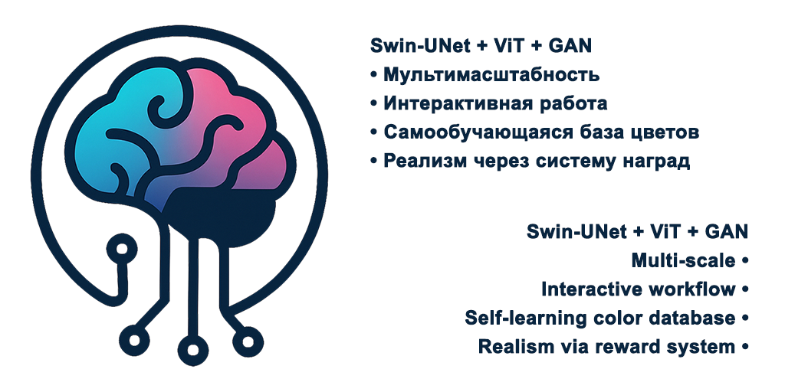

# TintoraAI: Продвинутая система колоризации изображений

<div align="center">
  
  <h3>Превращайте черно-белые изображения в яркие цветные с помощью ИИ</h3>
  <p>Умная колоризация • Стилистические пресеты • Гибкая настройка</p>
</div>


TintoraAI - это современная система для интеллектуальной колоризации черно-белых изображений с использованием передовых методов глубокого обучения. Проект предлагает уникальное сочетание Swin-UNet трансформерной архитектуры, Vision Transformer для семантического понимания изображений, и инновационных модулей, включая систему "наград и наказаний" для реалистичной колоризации.

## ✨ Особенности

- **Передовая архитектура** - Swin-UNet backbone с трансформерами, FPN, Pyramid Pooling и Multi-Head Feature Fusion
- **Понимание контекста** - ViT семантический блок распознает объекты и контекст для выбора правильных цветов
- **Интеллектуальные модули**:
  - 🎨 **GuideNet** - советник по цветам на основе анализа содержимого изображения
  - 👁️ **GAN Discriminator** - оценка реалистичности с системой наград/наказаний
  - 🖌️ **Style Transfer** - применение различных исторических и художественных стилей
  - 🧠 **Memory Bank** - самообучающаяся база знаний о цветовых закономерностях
  - 📊 **Uncertainty Estimation** - оценка уверенности модели в выбранных цветах
- **Удобное использование**:
  - 📱 Интерактивное демо с выбором стилей
  - 💻 Командная строка с прогресс-индикаторами
  - 🌐 REST API для интеграции с другими системами
  - ⚙️ Настройка через YAML-конфигурации без изменения кода
- **Контроль качества** - встроенные метрики (LPIPS, SSIM, PSNR) для оценки результатов

## 🚀 Быстрый старт

### Установка

```bash
# Клонирование репозитория
git clone https://github.com/T1desLuck/TintoraAI.git
cd TintoraAI

# Установка зависимостей
pip install -r requirements.txt

# Настройка проекта (создание директорий и проверка окружения)
python scripts/setup.py
```

### Колоризация одного изображения
```bash
python scripts/inference.py --single input/single/your_image.jpg --checkpoint experiments/checkpoints/model.pth --output-dir output
```

### Пакетная обработка нескольких изображений
```bash
python scripts/batch_process.py --input-dir input/batch --checkpoint experiments/checkpoints/model.pth --output-dir output --save-comparison
```

### Запуск интерактивного демо
```bash
python scripts/demo.py --checkpoint experiments/checkpoints/model.pth --console
```

## 📖 Документация
Подробное описание всех функций, настроек и примеры использования доступны в следующих документах:

- [Инструкция по установке](INSTALL.md) - подробное руководство по установке на различных платформах
- [Руководство по обучению](TRAINING.md) - как подготовить данные и обучить модель
- [API документация](API.md) - описание API для интеграции с другими системами

## 🖼️ Примеры результатов
<div align="center">
  
  <p><i>Сравнение исходного черно-белого изображения и результата колоризации</i></p>
  
  <p><i>Применение разных стилей к одному изображению</i></p>
</div>

## 🧠 Архитектура системы
TintoraAI построен на основе современной трансформерной архитектуры с множеством инновационных модулей:

```
Входное изображение
      │
      ▼
  Swin-UNet ───┬───► ViT Семантический блок
      │        │             │
      ▼        │             ▼
FPN + Pyramid  │       Семантические признаки
      │        │             │
      ▼        │             │
 Признаки ◄────┴─────────────┘
      │
      ▼
Cross-Attention Bridge
      │
      ▼
Multi-Head Feature Fusion
      │
      ▼
  GuideNet ◄────► Discriminator
      │               │
      │      Memory Bank
      │               │
      ▼               ▼
  Колоризованное изображение
```

## 🛠️ Настройка
Все компоненты системы можно гибко настроить через конфигурационные файлы YAML в директории `configs/`:

- `main_config.yaml` - основные настройки проекта
- `model_config.yaml` - архитектура модели
- `training_config.yaml` - параметры обучения
- `loss_config.yaml` - настройки loss-функций
- `inference_config.yaml` - параметры инференса

Пример настройки стиля колоризации:

```yaml
# В configs/inference_config.yaml
style:
  preset_name: "vintage"  # vintage, vivid, monochrome, cinematic
  style_strength: 0.8
```

## 🔧 Требования
- Python 3.7 или выше
- PyTorch 1.9.0 или выше
- CUDA 11.1+ (для GPU-ускорения)
- 8GB+ RAM (16GB+ рекомендуется)
- GPU с 6GB+ VRAM для обучения, 2GB+ для инференса

## ⚙️ Как внести вклад
1. Форкните репозиторий
2. Создайте ветку для вашей функциональности
3. Внесите изменения и протестируйте их
4. Отправьте Pull Request с подробным описанием изменений

## 📊 Производительность
| Метрика       | Значение      | Описание                         |
|---------------|---------------|----------------------------------|
| SSIM          | ≥ 0.82        | Структурное сходство            |
| LPIPS         | ≤ 0.20        | Перцептуальное сходство         |
| FPS (CPU)     | ~1-2          | Кадров в секунду на CPU         |
| FPS (GPU)     | ~20-30        | Кадров в секунду на GPU (RTX 2080) |

## 📜 Цитирование
Если вы используете TintoraAI в своих исследованиях, пожалуйста, процитируйте наш проект:

```bibtex
@software{TintorAI,
  author = {T1desLuck},
  title = {TintoraAI: Продвинутая система колоризации изображений},
  year = {2025},
  url = {https://github.com/T1desLuck/TintoraAI}
}
```

## 🙏 Благодарности
- Swin Transformer - за архитектуру трансформеров
- CycleGAN и pix2pix - за вдохновение в области генеративных моделей
- PyTorch - за фреймворк глубокого обучения

## 📞 Контакты
- GitHub Issues: https://github.com/T1desLuck/TintoraAI/issues
- Email: tidesluck@icloud.com

## 📄 Лицензия
Этот проект распространяется под лицензией MIT. См. файл LICENSE для более подробной информации.
