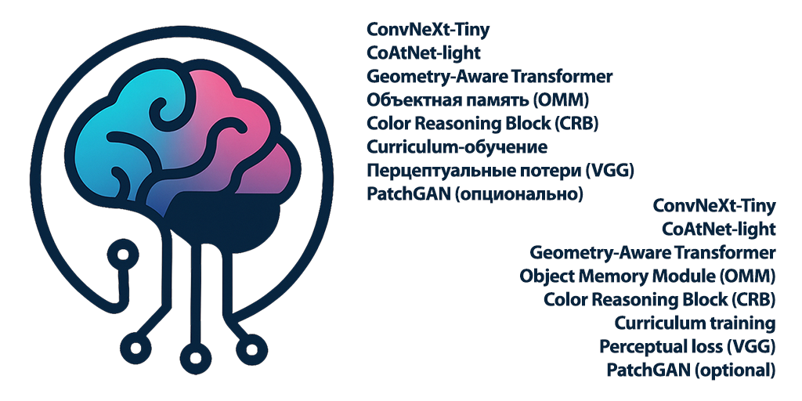
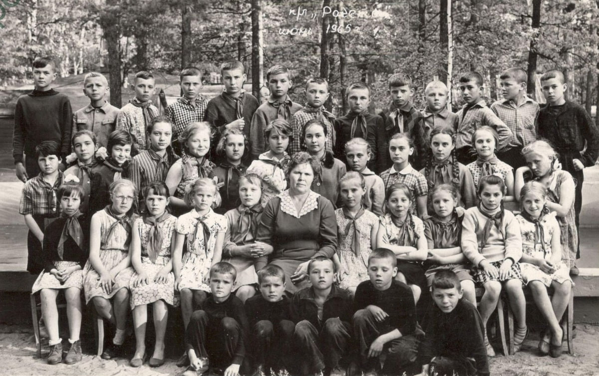
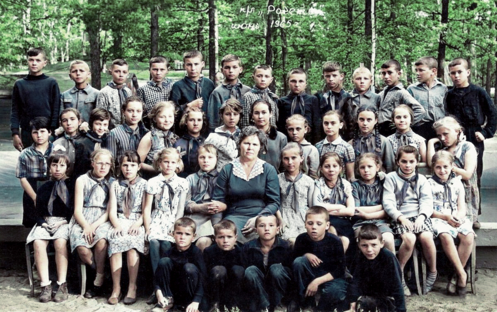

# TintoraAI: Продвинутая система колоризации изображений

<div align="center">
  
  <h3>Превращайте черно-белые изображения в яркие цветные с помощью ИИ</h3>
  <p>Умная колоризация • Гибкая настройка</p>
</div>

<div align="center">

[](https://www.python.org/)
[](https://pytorch.org/)
[](https://github.com/T1desLuck/TintoraAI.git)
[](https://github.com/T1desLuck/TintoraAI/blob/a588a27c8a52600bb0cfbf9eff56a0291502f78e/LICENSE)
[](https://colab.research.google.com/gist/T1desLuck/2c599c68aa99e88308a2d5b0f79af634/tintoraai.ipynb)
[](https://github.com/T1desLuck/TintoraAI)
[](https://developer.nvidia.com/cuda-downloads)
[](https://www.kernel.org/)
[](https://github.com/T1desLuck/TintoraAI/network/members)

[](https://github.com/T1desLuck/TintoraAI/actions/workflows/python-app.yml)

</div>

 TintoraAI — это современная система для интеллектуальной колоризации черно-белых изображений на PyTorch. Текущая архитектура объединяет многоэтапный энкодер (ConvNeXt‑Tiny → CoAtNet‑light → Geometry‑Aware Transformer), вспомогательные головы глубины/освещённости, модуль объектной памяти (OMM), блок цветового рассуждения (CRB) и декодер U‑Net++ с FiLM и PixelShuffle. Поддерживается поэтапное обучение (curriculum), перцептуальная потеря (VGG) для обучения и опциональный PatchGAN на поздней фазе.

## ✨ Особенности

> [!IMPORTANT]
> **Гибридный энкодер** — ConvNeXt‑Tiny (локальные детали) → CoAtNet‑light (Conv+Attention) → Geometry‑Aware Transformer (глобальный контекст)
>
> **Семантическая согласованность** — OMM (банк прототипов) + CRB формируют глобальные цветовые условия для FiLM в декодере
>
> 🧩 **VGG только для обучения** — используетcя исключительно для perceptual loss; на инференсе не нужен и в модель не входит. Других внешних весов не используется.
>
> ⚡ **AMP + EMA по умолчанию** — AMP ускоряет и экономит память; EMA стабилизирует качество и применяется на инференсе.

> [!NOTE]
> 🎯 **Curriculum‑обучение** — поэтапная активация компонентов: SSL предобучение → базовое L1 → геометрия → перцептуалка → OMM чтение/ColorConsistency → GAN
>
> 👁️ **PatchGAN (опц.)** — подключается на финальной фазе для повышения реалистичности
>
> 🧠 **OMM** — объектная память с EMA‑обновлением прототипов и статистикой цветов
>
> 🧵 **Распределённое обучение (DDP)** — поддержка torchrun; синхронизация OMM выполняется на каждом шаге обучения.
>
> 🧩 **Грид‑пулинг OMM** — адаптивная сетка регионов (по умолчанию 7×7). Меняется через `omm.extra_params.grid` в `configs/default.yaml`.

> [!TIP]
> 💻 Командная строка с прогресс-индикаторами
>
> ⚙️ Настройка через YAML-конфигурации без изменения кода
>
> **Контроль качества** — поддержка расчёта метрик (SSIM и опционально LPIPS) в процессе валидации
>
> 🖼 **Произвольные размеры на инференсе** — автоматический padding до кратности 8 и обратный unpad.
>
> 🗺 **Тайловый инференс** — для очень больших изображений с overlap и feathering краёв.
>
> 🧪 **Тестирование** — см. `TEST.md` для описания тестов и сценариев запуска `test_project.py`.
>
> 🔁 **Воспроизводимость** — ключи `project_name` и `seed` в `configs/default.yaml` для фиксирования экспериментов.

## 🚀 Быстрый старт

### Установка

```bash
# Клонирование репозитория
git clone https://github.com/T1desLuck/TintoraAI.git
cd TintoraAI

# Установка зависимостей
pip install -r requirements.txt

# (опционально) Создайте виртуальное окружение и активируйте его
python -m venv venv && source venv/bin/activate  # Windows: venv\Scripts\activate
```

### Колоризация одного изображения
```bash
python -m src.inference --input path/to/image_or_dir --checkpoint checkpoints/latest.pth --config configs/default.yaml --tile 0
```

> Примечание: флаг `--checkpoint` опционален — при отсутствии явного пути инференс использует `paths.checkpoints` и имя из `checkpointing.latest_names.model` в `configs/default.yaml`.

### Пакетная обработка каталога
```bash
python -m src.inference --input data/test --checkpoint checkpoints/latest.pth --config configs/default.yaml --tile 512 --overlap 32
```

### Запуск обучения (см. подробности в TRAINING.md)
```bash
python -m src.train --config configs/default.yaml
```

#### Распределённый запуск (много‑GPU)
```bash
torchrun --standalone --nproc_per_node=NUM_GPUS -m src.train --config configs/default.yaml
```

## 📖 Документация
Подробное описание всех функций, настроек и примеры использования доступны в следующих документах:

- [Инструкция по установке](INSTALL.md) — подробное руководство по установке на различных платформах
- [Руководство по обучению](TRAINING.md) — подготовка данных, конфигурация и запуск обучения
- [Руководство по тестированию](TEST.md) — как запускать тесты, какие файлы что проверяют, примеры сценариев

## 🖼️ Примеры результатов
<div align="center">
  
  <p><i>Сравнение исходного черно-белого изображения и результата колоризации</i></p>
  
  <p><i>Применение разных стилей к одному изображению</i></p>
</div>

## 🧠 Архитектура системы
TintoraAI построен как гибрид Conv+Attention автокодер с модулем памяти:

```
Вход L (1×H×W)
      │
      ▼
ConvNeXt‑Tiny  →  CoAtNet‑light  →  Geometry‑Aware Transformer
   (F1 H/4)         (F2 ≈ H/8)            (F3 ≈ H/16)
      │                    │                     │
      └──────────────┬─────┴─────────────┬───────┘
                     ▼                   ▼
            Depth / Illum Heads      Region Pooling (grid, по умолчанию 7×7)
                     │                   │
                     ▼                   ▼
                 Нормали               OMM (банк прототипов: N×D)
                     │                   │
                     └──────────┬────────┘
                                ▼
                         CRB (c_color)
                                ▼
                U‑Net++ Decoder + FiLM + PixelShuffle
                                ▼
                      Предсказания a,b (+sat)
                                ▼
                          Lab→RGB (Выход)
```
> [!NOTE]
> В текущей реализации выход ConvNeXt‑Tiny (`F1`, масштаб H/4) подаётся в CoAtNet‑light, после чего берётся карта признаков стадии `out_indices=2` (см. `CoAtNetLight`). Далее `GATLight` даунсэмплирует ×2. Это даёт фактические масштабы признаков: `F2 ≈ H/8`, `F3 ≈ H/16`. Для совместимости выполняется приведение каналов `256→192` через `coatnet_channel_fix` (см. `src/models/tintoraai.py`). Переключение на иные стадии CoAtNet упоминается как потенциальная опция, но в текущей версии не параметризовано и потребует изменения каналов и переобучения.

## 🛠️ Конфигурация
Проект настраивается через один файл `configs/default.yaml`:

- `project_name`, `seed`: имя проекта и глобальный сид
- `paths`: директории данных, логов, чекпоинтов
- `runtime`: AMP, DDP, num_workers, устройство
- `checkpointing`: имена и политика сохранения `latest`/`best`
- `optimizer`: тип, разные LR для backbone/decoder, weight decay
- `scheduler`: схема (например, cosine), warmup
- `training`: батч, эпохи, image_size, dataset, aug, EMA, DLB, curriculum (фазы −1…4)
- `loss`: веса L1/Perceptual/Photometric/CC/Entropy/Cluster/Adv
- `omm`: N, D, top_k, tau, alpha, min_support, sync
- `model`: c1/c2/c3, film_dim, use_saturation_head, use_guidenet (+ guide_feature_dim/guide_out_dim)
- `gan`: параметры PatchGAN (если включён)
- `ssl`: настройки PatchNCE для предобучения (Phase −1)
- `validation`: батч, метрики (SSIM/LPIPS), параметры окон
- `logging`: TensorBoard/W&B и частота логирования

См. пример значений в `configs/default.yaml`.

### Геометрия препроцессинга и интерполяция (resize)
Для гибкого управления подготовкой изображений добавлены параметры в секции `training.geometry` и `training.resize`:

```yaml
training:
  image_size: 256
  geometry:
    train_mode: random_crop        # random_crop | center_crop | random_resized_crop
    val_mode: center_crop          # center_crop | random_crop | random_resized_crop
  resize:
    filter: lanczos                # lanczos | bicubic | bilinear | nearest
```

- **train_mode/val_mode**: выбирают геометрию приведения к квадрату `image_size`.
  - `random_crop`: пропорциональный resize по короткой стороне ≥ `image_size`, затем случайный кроп `image_size×image_size`.
  - `center_crop`: пропорциональный resize по короткой стороне ≥ `image_size`, затем центр‑кроп.
  - `random_resized_crop`: случайный масштаб/кроп с сохранением аспекта, затем приведение к `image_size` (использует диапазон `training.aug.crop_scale`).
- **resize.filter**: интерполяция PIL при изменении размера. По умолчанию `lanczos` (качество выше), также доступны `bicubic`, `bilinear`, `nearest`.

Эти настройки применяются консистентно во всех местах:
- `src/datasets/advanced_dataset.py` и `src/datasets/simple_dataset.py` (обучение/валидация)
- `src/train.py` (передача параметров в датасеты)
- `scripts/preview_preprocessing.py` (визуальный предпросмотр той же геометрии/фильтра)

## 🔧 Требования
- Python 3.9+
- PyTorch 2.3.1 (см. `requirements.txt`), колёса с CUDA 12.1 доступны на Windows/Linux
- 8GB+ RAM (рекомендовано 16GB+)
- GPU 6GB+ VRAM для обучения на 256×256; для инференса достаточно 2–4GB

## ⚙️ Как внести вклад
1. Форкните репозиторий
2. Создайте ветку для вашей функциональности
3. Внесите изменения и протестируйте их
4. Отправьте Pull Request с подробным описанием изменений

## 📊 Целевые показатели (по ТЗ)
| Метрика       | Цель          | Примечание                       |
|---------------|---------------|----------------------------------|
| SSIM          | ≥ 0.82        | Структурное сходство            |
| LPIPS         | ≤ 0.20        | Перцептуальное сходство         |
| FPS (CPU)     | ~1–2          | Зависит от размера изображения  |
| FPS (GPU)     | ~20–30        | На GPU уровня RTX 2080          |

## 📜 Цитирование
Если вы используете TintoraAI в своих исследованиях, пожалуйста, процитируйте наш проект:

```bibtex
@software{TintorAI,
  author = {T1desLuck},
  title = {TintoraAI: Продвинутая система колоризации изображений},
  year = {2025},
  url = {https://github.com/T1desLuck/TintoraAI}
}
```

## 🙏 Благодарности
- PyTorch — за фреймворк глубокого обучения
- ConvNeXt — за идеи архитектуры бэкбона ранних этапов энкодера
- CoAtNet — за гибрид Conv+Attention подход для среднего уровня признаков
- ColorFormer (ECCV'22) — за концепцию memory decoder/прототипов для цветовой согласованности
- PatchGAN — за идею локального дискриминатора для адверсариального обучения (фаза 4)
- VGG — за перцептуальные признаки для perceptual loss
- SimCLR — за идеи self-supervised pre-training (contrastive) для разогрева энкодера

## 📞 Контакты
- GitHub Issues: https://github.com/T1desLuck/TintoraAI/issues
- [](mailto:tidesluck@icloud.com)

## 📁 Дерево проекта (с комментариями)
Ниже приведена структура репозитория с краткими пояснениями по ключевым файлам и папкам. Папки для данных и результатов могут отсутствовать при клонировании (GitHub не хранит пустые директории) — создайте их вручную, как показано ниже.

```text
TintoraAI/
├─ README.md                      # Общее описание проекта, ссылки и быстрый старт
├─ INSTALL.md                     # Подробная установка
├─ TRAINING.md                    # Руководство по обучению модели
├─ TEST.md                        # Руководство по тестированию и сценарии запуска
├─ requirements.txt               # Зависимости проекта
├─ main.py                        # Точка входа (при необходимости)
├─ test_project.py                # Русскоязычный лаунчер тестов
├─ configs/                       # Конфигурации (YAML)
│  └─ default.yaml                # Базовая конфигурация (пути, обучение, лоссы, модель)
├─ src/                           # Исходный код библиотеки TintoraAI
│  ├─ __init__.py                 # Инициализация пакета src
│  ├─ train.py                    # Скрипт обучения: python -m src.train --config ...
│  ├─ inference.py                # Скрипт инференса: python -m src.inference --input ...
│  ├─ datasets/                   # Датасеты и аугментации
│  │  ├─ __init__.py
│  │  ├─ simple_dataset.py        # Простой датасет (пример)
│  │  ├─ advanced_dataset.py      # Продвинутый датасет (используется по умолчанию)
│  │  └─ augmentations.py         # Базовые аугментации
│  ├─ losses/                     # Функции потерь
│  │  ├─ __init__.py
│  │  ├─ advanced.py              # PhotometricSmoothnessLoss и др.
│  │  ├─ basic.py                 # Базовые потери (L1 и т.п.)
│  │  ├─ perceptual.py            # Перцептуальные потери (VGG)
│  │  ├─ gan.py                   # Потери для GAN
│  │  └─ patchnce.py              # Настройки/заготовка для SSL PatchNCE
│  ├─ models/                     # Архитектура модели
│  │  ├─ __init__.py              # Инициализация пакета моделей
│  │  ├─ discriminator.py         # PatchGAN дискриминатор (фаза 4)
│  │  ├─ guidenet.py              # Доп. сеть-подсказчик (опционально)
│  │  ├─ tintoraai.py             # Основной класс модели TintoraAI
│  │  ├─ backbone/                # Бэкбоны (ConvNeXt/CoAtNet/GAT)
│  │  │  ├─ __init__.py
│  │  │  ├─ convnext_tiny.py      # Реализация ConvNeXt‑Tiny (ранний этап энкодера)
│  │  │  ├─ convnext_wrapper.py   # Обёртка/унификация интерфейса ConvNeXt
│  │  │  ├─ coatnet_light.py      # Лёгкий CoAtNet (Conv+Attention) для среднего уровня
│  │  │  ├─ coatnet_wrapper.py    # Обёртка/конфигурация CoAtNet
│  │  │  └─ gat_light.py          # Geometry‑Aware Transformer (облегчённый, глобальный контекст)
│  │  ├─ heads/                   # Головы глубины/освещённости/и т.п.
│  │  │  ├─ __init__.py           # Инициализация пакета голов
│  │  │  └─ heads.py
│  │  ├─ crb/                     # Color Reasoning Block (CRB)
│  │  │  ├─ __init__.py           # Инициализация пакета CRB
│  │  │  └─ crb.py
│  │  ├─ omm/                     # Object Memory Module (OMM)
│  │  │  ├─ __init__.py           # Инициализация модуля памяти
│  │  │  └─ object_memory.py      # Банк прототипов: assign (cosine/top‑k), EMA‑обновления, min_support, статистика цветов (μ/σ), чтение/запись
│  │  └─ decoder/                 # Декодер (U‑Net++)
│  │     ├─ __init__.py           # Инициализация пакета декодера
│  │     └─ decoder_unetpp.py
│  └─ utils/                      # Утилиты и вспомогательные модули
│     ├─ __init__.py
│     ├─ balancer.py              # Альтернативный балансировщик потерь
│     ├─ config.py                # Утилиты для работы с конфигами
│     ├─ dist.py                  # Вспомогательные функции для DDP/распределёнки
│     ├─ dlb.py                   # DynamicLossBalancer
│     ├─ lab_color.py             # Преобразования Lab/RGB
│     ├─ metrics.py               # Метрики (SSIM/LPIPS)
│     └─ seed.py                  # Фиксация сидов/детерминизм
├─ tests/                         # Набор автотестов (pytest)
│  ├─ test_dlb.py                 # Тесты балансировщика потерь
│  ├─ test_forward.py             # Быстрый прогон forward модели
│  ├─ test_inference.py           # Тесты инференса (single/tiled)
│  ├─ test_losses.py              # Тесты лоссов (advanced и др.)
│  └─ test_modules.py             # Модули: backbone/heads/CRB/decoder
├─ scripts/                       # Утилиты/скрипты
│  └─ preview_preprocessing.py    # Предпросмотр подготовки изображения (Lab, L‑канал, дефекты)
├─ data/                          # [Папка-плейсхолдер] Данные (создайте вручную)
│  ├─ train/                      # Обучающие изображения (jpg/png) без подпапок
│  ├─ val/                        # Валидационные изображения
│  └─ test/                       # Тестовые изображения (опционально)
├─ checkpoints/                   # [Папка-плейсхолдер] Чекпоинты моделей (*.pth)
├─ logs/                          # [Папка-плейсхолдер] Логи (TensorBoard, тексты)
└─ experiments/                   # [Папка-плейсхолдер] Эксперименты/визуализации
   └─ exp_default/                # Каталог эксперимента по умолчанию
```

Примечания:
- Плейсхолдер‑папки (`data/`, `checkpoints/`, `logs/`, `experiments/…`) создаются пользователем локально — они не версионируются, если пустые.
- Пути по умолчанию настраиваются в `configs/default.yaml` секция `paths.*`.
- Для инференса минимум нужен вход (`--input`), конфиг и (обычно) чекпоинт из `checkpoints/`.

Дополнительно — предпросмотр подготовки изображений:
- Скрипт `scripts/preview_preprocessing.py` позволяет визуально проверить пайплайн подготовки (resize/crop/flip, перевод в Lab, сохранение L‑канала) и опциональные L‑дефекты.
- Удобнее запускать через лаунчер: `python test_project.py preview --input assets/color.jpg --save_L --enable_defects`.
- Выходные файлы сохраняются в `experiments/exp_default/preview_preprocess` (или папку, указанную флагом `--output`).
 - Конфиг дефектов: блок `training.aug.defects` в `configs/default.yaml`. По умолчанию выключено (`enabled: false`); активация через флаг `--enable_defects`.

## 🧪 Тесты

Рекомендуемый способ — удобный лаунчер в корне проекта `test_project.py`:

```powershell
# Справка и список целей
python test_project.py help
python test_project.py list

# Запуск полного набора
python test_project.py run all

# Примеры точечных запусков
python test_project.py run modules
python test_project.py run modules::test_crb
python test_project.py run inference
```

Лаунчер печатает понятные сообщения на русском об успешном прохождении или причинах ошибок. Его также удобно вызывать из Jupyter/Colab:

```python
from test_project import run, show_help, list_targets
show_help(); list_targets(); run("modules")
```

Альтернатива: запуск напрямую через pytest

```powershell
pip install pytest
pytest -q                    # все тесты
pytest tests/test_inference.py -q
pytest -q -k "forward"
```

Что покрывают тесты:
- Проверка прямого прохода модели (`tests/test_forward.py`).
- Инференс одиночный и тайловый (`tests/test_inference.py`).
- Базовые лоссы и дополнительные компоненты (`tests/test_losses.py`).
- Модули бэкбонов/голов/декодера и утилиты (`tests/test_modules.py`).
- Балансировщик потерь DLB (`tests/test_dlb.py`).

Ожидаемый результат: краткий отчёт об успехе/падениях (через `test_project.py`) или отчёт pytest. Подробности и сценарии см. в `TEST.md`.

## 📄 Лицензия
Этот проект распространяется под лицензией MIT. См. файл LICENSE для более подробной информации.
